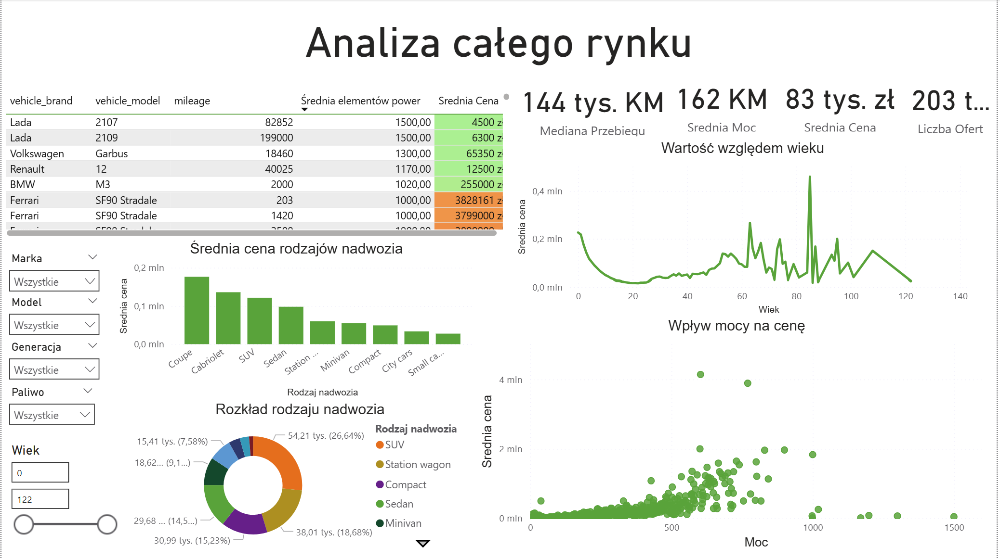

# Analiza polskiego rynku motoryzacyjnego & Przewidywanie cen (End-to-End Data Pipeline)

## Opis projektu
Głównym celem projektu było przeprowadzenie kompleksowej analizy polskiego rynku aut używanych oraz zbudowanie modelu uczenia maszynowego zdolnego do precyzyjnej wyceny pojazdów na podstawie ich parametrów technicznych. Projekt spina cały cykl życia danych (Data Science Lifecycle) – od surowego pliku, poprzez inżynierię cech, aż po interaktywny pulpit dla biznesu.

## Źródło danych
Analiza została przeprowadzona na zbiorze danych zeskrapowanym z portalu Otomoto, zawierającym ponad 200 000 ogłoszeń sprzedaży z kwietnia 2023 roku. 
Ze względu na rozmiar pliku, surowe dane nie są udostępniane w tym repozytorium. Zbiór referencyjny można pobrać z platformy Kaggle: 
[Car sales offers from Otomoto.pl (2023)](https://www.kaggle.com/datasets/szymoncyperski/car-sales-offers-from-otomotopl-2023)

## Wykorzystane technologie
* **Język:** Python 3
* **Przetwarzanie danych:** Pandas, NumPy
* **Machine Learning:** Scikit-learn (Random Forest Regressor, Target Encoding)
* **Wizualizacja (Python):** Matplotlib, Seaborn
* **Business Intelligence:** Power BI, DAX

## Krok po kroku: Jak zrealizowano projekt?
1. **Data Wrangling (Czyszczenie danych):** 
   * Usunięcie jednostek tekstowych (np. "km", "cm3") z kolumn i konwersja na typy numeryczne (`float`/`int`).
   * Skonstruowanie nowych zmiennych, m.in. wieku pojazdu na podstawie rocznika produkcji.
2. **Usuwanie anomalii (Outliers):**
   * Zastosowanie filtracji kwantylowej (odcięcie skrajnych 0.01% wartości) dla ceny, przebiegu, mocy i pojemności silnika, minimalizujące wpływ błędów wprowadzania danych przez użytkowników portalu.
3. **Inżynieria cech (Feature Engineering):**
   * Wykorzystanie techniki **Target Encoding** dla nowo utworzonej kolumny agregującej markę, model i generację (`brand_model_gen`). Pozwoliło to modelowi optymalnie zinterpretować rynkową hierarchię pojazdów bez nadmiernego zwiększania wymiarowości zbioru (uniknięcie problemów One-Hot Encoding).
4. **Modelowanie Predykcyjne:**
   * Wytrenowanie algorytmu **Random Forest Regressor**.
   * Osiągnięty współczynnik determinacji **R^2 = 0.936**, dowodzący, że model wyjaśnia blisko 94% wariancji cen na rynku. Średni błąd bezwzględny (MAE) na zbiorze testowym wyniósł ok. 10 600 PLN.
5. **Wizualizacja Biznesowa (Power BI):**
   * Zaprojektowanie interaktywnego dashboardu analitycznego na podstawie przetworzonych danych.
   * Implementacja dynamicznych tytułów (miary DAX) oraz formatowania warunkowego w celu płynniejszej nawigacji po kluczowych wskaźnikach KPI (Segmentacja, Wiek, Typ nadwozia).

## Podgląd Dashboardu (Power BI)

